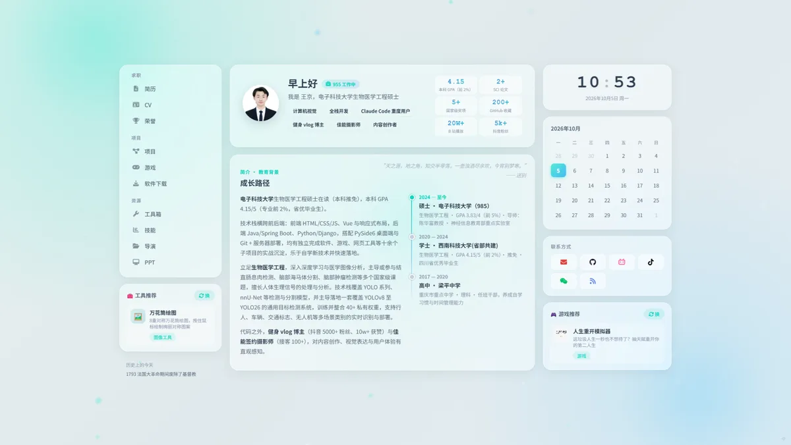
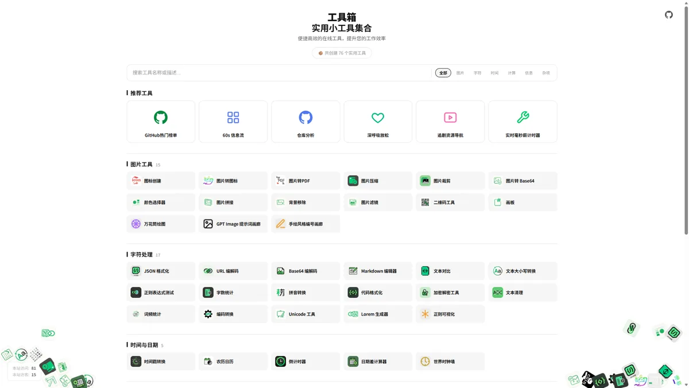
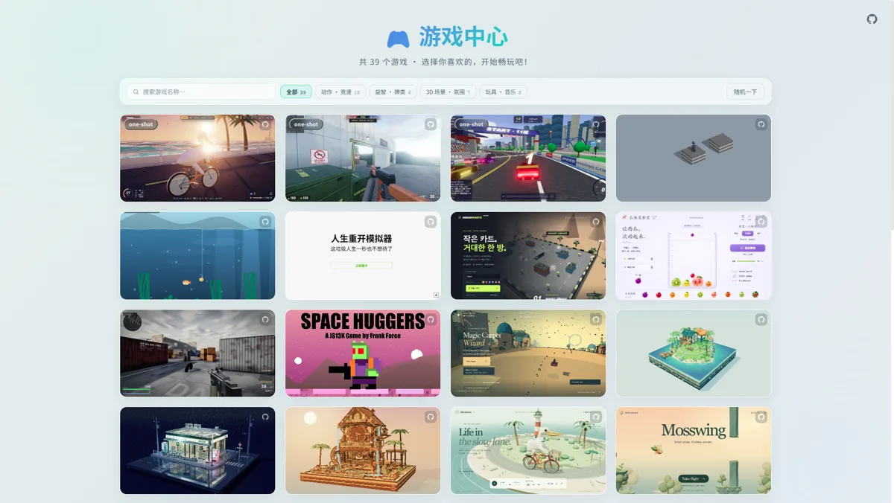
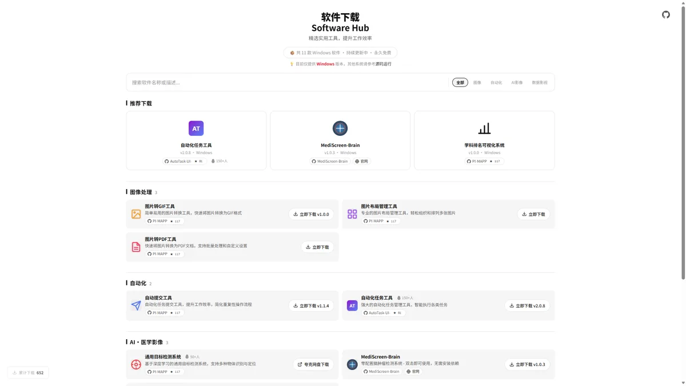

[中文](./README.md) | English

# JingW-ui.github.io

> A fully static personal site: 76 online tools, 11 Windows desktop applications, and 39 browser games — all free, ad-free, and build-free, hosted on GitHub Pages.

**Live site**：<https://jingw-ui.github.io>

## ✨ Screenshots

<table>
  <tr><td align="center"><a href="https://jingw-ui.github.io/"></a><br><b>Home</b> · Site-wide navigation + random picks</td></tr>
  <tr><td align="center"><a href="https://jingw-ui.github.io/tools/"></a><br><b>Online Toolbox</b> · 76 ready-to-use tools</td></tr>
  <tr><td align="center"><a href="https://jingw-ui.github.io/Games/"></a><br><b>Game Center</b> · 39 browser games</td></tr>
  <tr><td align="center"><a href="https://jingw-ui.github.io/softwares/"></a><br><b>Software Downloads</b> · 11 Windows apps</td></tr>
</table>

## What's Inside

| Module | Count | Description | Stack |
|--------|-------|-------------|-------|
| [Online Toolbox](https://jingw-ui.github.io/tools/) | 76 | Ready-to-use browser tools: image processing, format conversion, text & dev utilities. No install, no sign-up. | Vanilla HTML / CSS / JS |
| [Software Downloads](https://jingw-ui.github.io/softwares/) | 11 | Release pages for Windows desktop apps: introductions, source repos, and downloadable releases | Python (PySide6 / PyTorch / YOLOv8) |
| [Game Center](https://jingw-ui.github.io/Games/) | 39 | Browser games: casual, puzzle, action — just open and play | Canvas / vanilla JS |
| [Home](https://jingw-ui.github.io/) | — | Site-wide navigation with randomized recommendations | Vanilla HTML / CSS / JS |
| [Resume / Videos / Awards / Slides](https://jingw-ui.github.io/resume/) | 4 sections | Static pages: resume, videos, carousel, ppt | HTML / CSS |

## Metrics

| Metric | Data |
|--------|------|
| GitHub Stars |   |
| Software Downloads (Releases) |    |
| Bilibili views | **300k+** ([Microcomputer Principles review series](https://www.bilibili.com/video/BV1Sd4y1J7k5/) 227k · AutoTask demo 14k · Object detection demo 13k, as of 2026-10-03) |

## Tech Stack

**Site pages**:    (vanilla, no framework, no build step)

**Shipped software**:    (GUI built with PySide6, vision models on YOLOv8 / PyTorch)

**Tooling**:  auto-deployed via GitHub Pages

## Directory Layout

```
JingW-ui.github.io/
├── index.html                              # Home: navigation + random picks
├── tools/                                  # 76 online tools (one subdirectory each)
├── softwares/                              # Download index for 11 Windows apps
├── Games/                                  # 39 browser games (one subdirectory each)
├── resume/  cv/  videos/  carousel/  ppt/  # Resume / demo videos / awards gallery / slides
├── skills/                                 # AI Agent Skills
├── imgs/  resources/                       # Images and shared assets
└── sitemap.xml  llms.txt  llms-full.txt  robots.txt   # SEO/GEO: sitemap + AI-crawler policy
```

Interactive diagram: [gitdiagram.com/jingw-ui/jingw-ui.github.io](https://gitdiagram.com/jingw-ui/jingw-ui.github.io)

## Deployment

- Pure static HTML — pushing to `main` triggers an automatic GitHub Pages deploy, no build step.
- `robots.txt` explicitly allows AI and model-training crawlers; `llms.txt` / `llms-full.txt` provide LLM-oriented site indexes.
- Read this repo quickly with AI: [gitingest.com/JingW-ui/JingW-ui.github.io](https://gitingest.com/JingW-ui/JingW-ui.github.io)

## License

The root [LICENSE](LICENSE) is **MIT** and covers **only original work** in this repo. Third-party content and personal content are excluded — each directory keeps its own LICENSE / page notice:

- ✅ **MIT applies**: the home page, original tools under `tools/`, original games under `Games/` (included third-party games excluded — see below), and the glassmorphism design system — free to use and adapt; keep the copyright notice.
- 🔎 **Third-party content**: keeps its original license or inclusion notice, e.g. `Games/remake` (MIT mirror), `Games/operation-ironhold` (MIT), `tools/handraw-style` (MIT mirror), `tools/60s` (React/MIT), embedded three.js (MIT). `Games/smash-karts`, `Games/magic-carpet`, and `Games/bait-fish` have no upstream open-source license — included for learning only and removed upon request.
- 🚫 **Not open-sourced**: personal resume, job-hunting records, and photos under `cv/`, `resume/`, `videos/`, `carousel/`, `ppt/`, `reports/`, `resources/`, `tracker/`, `imgs/` — browsable online but not licensed; no redistribution, scraping, or model-training use.

---

For the author's background (education, competitions, internships), see the [online resume](https://jingw-ui.github.io/resume/).
